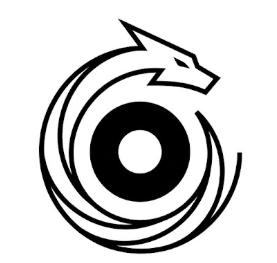

# RadDragon

## Concept

RadDragon est un moteur de simulation physique 2D cellule par cellule,
dans l'esprit de jeux comme *Noita* : chaque grain de matière (sable,
eau, lave, pierre, bois, poudre, glace...) est simulé individuellement —
pas de terrain "en dur", pas d'animation pré-calculée. Tout ce qui se
passe à l'écran — un tas de sable qui s'effondre, l'eau qui trouve son
niveau, le feu qui se propage, une explosion qui arrache un pan de falaise
en éclats qui retombent avec une vraie physique — est le résultat direct
du calcul, pas un script scénarisé.

Le monde est destructible et réactif au pixel près : creuser, brûler,
faire fondre, geler, faire exploser ou faire couler la matière change
réellement l'état du monde, et ce changement se propage à ses voisins
selon les lois propres à chaque matériau.

Le moteur est écrit pour tourner en temps réel sur du matériel modeste,
avec un cœur de simulation natif optimisé (C++) et un système de
chargement progressif du monde qui ne simule et n'affiche que ce qui est
réellement à proximité du joueur.

## Fonctionnalités

- Simulation cellulaire dense par chunks, streaming à la volée
  (chargement/déchargement selon la position du joueur)
- Réactions thermiques et chimiques entre matériaux (combustion, fonte,
  évaporation, gel, corrosion...)
- Diffusion de chaleur propagée dynamiquement dans le monde
- Cœur de simulation natif en C++ (GDExtension), threadé par damier de
  chunks pour exploiter plusieurs cœurs CPU
- Budget de calcul adaptatif : le moteur s'auto-calibre selon la
  puissance de la machine pour maintenir une fréquence stable

## Captures

## À propos de cette build

Cette version est fournie à titre de **démo de test/preview**. Elle peut
contenir des fonctionnalités incomplètes, des réglages non définitifs et
des outils de débogage.

## Signaler un bug / Feedback

Les retours (bugs, suggestions, ressenti) sont les bienvenus sur le
Discord du projet : https://discord.gg/C7SSazC9R

## Licence

© 2026  AretlithStudio. Tous droits réservés.

Cette démo est fournie à titre de test/preview uniquement. Toute
redistribution, décompilation, ingénierie inverse, ou utilisation
commerciale sans autorisation écrite est interdite. Le code source, les
assets et le moteur (RadDragon) restent la propriété exclusive de
l'auteur.
